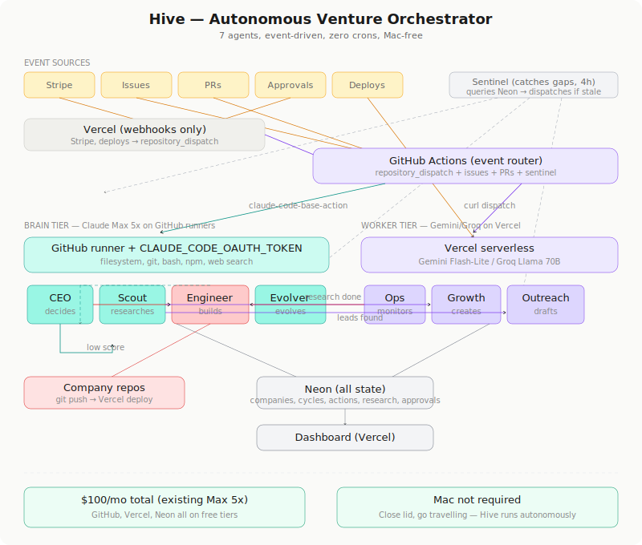

# Hive

Autonomous venture orchestrator. Generates business ideas, spins up companies, runs them with AI agents, kills failures.

**Carlos approves 4 gates.** New company, growth strategy, spend > €20, kill company. Everything else is autonomous.

## Architecture

<p align="center">
  
</p>

### How it works

Hive runs 7 AI agents across two tiers. Brain agents (CEO, Scout, Engineer, Evolver) run on GitHub Actions using Claude Code with a Max 5x OAuth token. Worker agents (Ops, Growth, Outreach) run on Vercel serverless using Gemini and Groq free APIs.

There are no scheduled crons. Agents are triggered by three mechanisms:

- **Events** — Stripe payment arrives, a deploy completes, you create a GitHub issue or approve a PR. These fire directly through GitHub's native event system or via `repository_dispatch` from Vercel webhooks.
- **Chains** — When one agent finishes, it dispatches the next. Scout delivers research → Growth creates content. CEO flags a problem → Scout investigates. Ops finds an error → Engineer fixes it.
- **Data conditions** — A lightweight sentinel queries Neon every 4 hours and dispatches agents whose work conditions are met (pipeline low, content stale, leads rotting). Most runs dispatch nothing. It catches gaps when chains break.

### Agents

| Agent | What it does | Triggered by |
|---|---|---|
| **CEO** | Plans cycles, reviews scores, portfolio analysis, kill recommendations | Payments, cycle completions, gates, PR reviews |
| **Scout** | Finds new business ideas, market/SEO/competitive research | Pipeline low, CEO requests, company killed |
| **Engineer** | Implements features, scaffolds companies, opens and merges PRs | GitHub issues (feature/bug), CEO, Ops escalation |
| **Ops** | Health checks, metrics, error detection + fixing | Deploys, agent failures, sentinel |
| **Growth** | Creates blog posts, SEO content, social posts | Scout research delivered, sentinel (stale content) |
| **Outreach** | Finds prospects, drafts cold emails, plans follow-ups | Scout leads delivered, sentinel (stale leads) |
| **Evolver** | Analyses agent performance, proposes prompt improvements | Cycle count threshold, failure rate threshold |

### Stack

| Layer | Service | Plan |
|---|---|---|
| Intelligence | Claude Max 5x via `claude setup-token` OAuth | $100/mo |
| Compute (brain) | GitHub Actions, ubuntu runners | Free (private, ~46% of 2,000 min limit) |
| Compute (workers) | Vercel serverless (Gemini Flash-Lite, Groq Llama 70B) | Free (Hobby) |
| Database | Neon serverless Postgres | Free |
| Dashboard | Next.js on Vercel | Free (Hobby) |

**Total cost: $100/mo.** Mac not required — close the lid, Hive keeps running.

### Interacting with Hive

All interaction happens through GitHub:

- **Create an issue** with label `directive` → CEO decomposes into tasks
- **Create an issue** with label `feature` → Engineer implements it
- **Create an issue** with label `research` → Scout investigates
- **Approve a PR** → Engineer merges and deploys
- **Comment mentioning an agent** → That agent responds in the thread
- **Approve a gate** in the dashboard → Dependent agent proceeds

### Key decisions

See [DECISIONS.md](./DECISIONS.md) for the full Architecture Decision Record log. Key ones:

- **ADR-009**: Multi-provider model routing (Claude for brain, Gemini/Groq for workers)
- **ADR-010**: Multi-repo with shared intelligence layer
- **ADR-011**: Event-driven execution on GitHub Actions with Max 5x OAuth
- **ADR-012**: Agent consolidation from 10 to 7

## Setup

### Prerequisites

- Claude Max 5x subscription
- GitHub account (private repo, event-driven model stays within 2,000 min/mo free tier)
- Vercel Hobby account
- Neon free-tier database

### Quick start

```bash
# 1. Generate a 1-year OAuth token from your Max 5x subscription
claude setup-token
# Copy the sk-ant-oat01-... token

# 2. Add secrets to GitHub repo → Settings → Secrets → Actions
#    CLAUDE_CODE_OAUTH_TOKEN = (token from step 1)
#    DATABASE_URL = (Neon connection string)
#    CRON_SECRET = (random 32-char hex: openssl rand -hex 32)
#    GITHUB_PAT = (fine-grained token with contents:write)

# 3. Deploy to Vercel
vercel deploy --prod

# 4. Run migration
psql $DATABASE_URL < migrations/003_agent_consolidation.sql

# 5. Test — trigger CEO agent manually
# Go to GitHub → Actions → "Hive CEO" → Run workflow
```

## Project structure

```
hive/
├── .github/workflows/     # Agent workflow files (event triggers + chains)
│   ├── hive-ceo.yml
│   ├── hive-scout.yml
│   ├── hive-engineer.yml
│   ├── hive-evolver.yml
│   ├── hive-workers.yml   # Worker agent dispatch (curl → Vercel)
│   └── hive-sentinel.yml  # Data condition checker
├── src/app/
│   ├── api/agents/        # Worker dispatch endpoint + company list
│   ├── api/webhooks/      # Stripe → repository_dispatch
│   ├── dashboard/         # Approval gates, company views, agent activity
│   └── ...
├── migrations/            # Neon schema migrations
├── docs/
│   └── architecture.svg   # Architecture diagram
├── DECISIONS.md           # Architecture Decision Records
├── BRIEFING.md            # Context for brain agents
├── MEMORY.md              # Cross-company learnings
└── MISTAKES.md            # Production incident log
```

## License

Private. All rights reserved.
