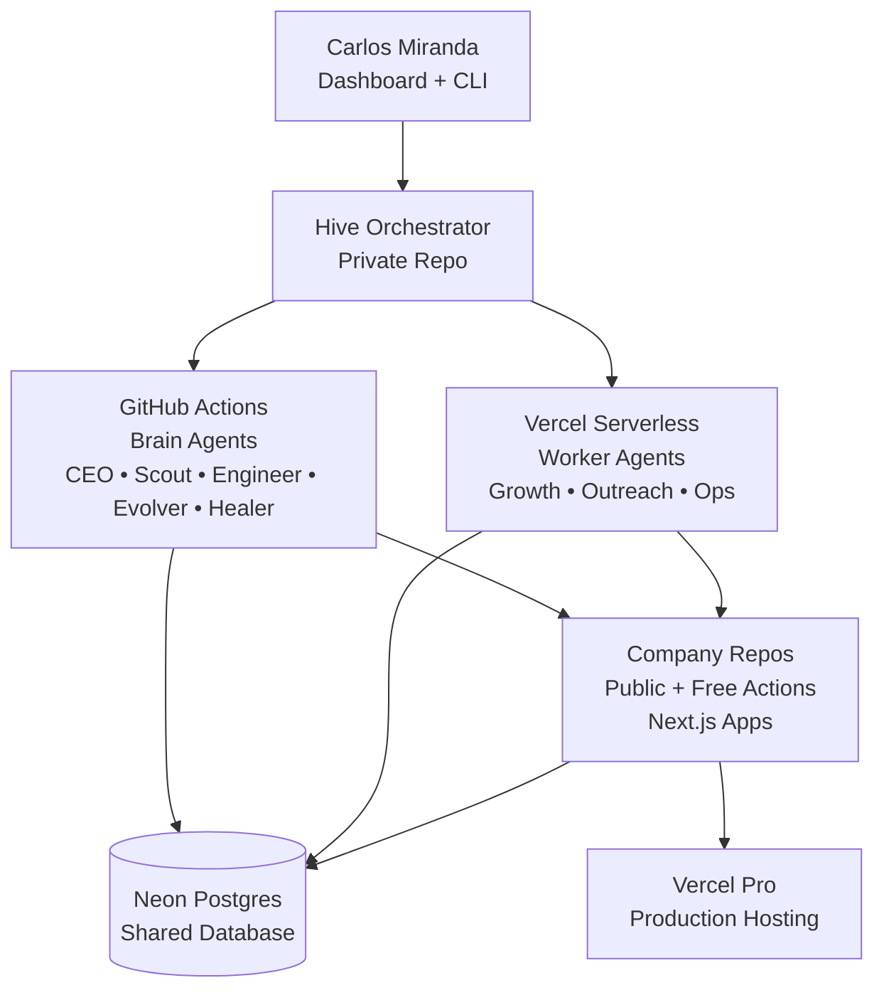

# Hive — Autonomous Venture Orchestrator

An AI system that builds, runs, and evaluates digital companies autonomously using 7 AI agents coordinated through GitHub Actions and Vercel serverless.

## What it does

- **Builds complete companies** — Scaffolds Next.js apps, provisions infrastructure, deploys to production
- **7 specialized AI agents** — CEO (planning), Scout (research), Engineer (building), Growth (content), Outreach (leads), Ops (monitoring), Evolver (optimization)
- **Event-driven architecture** — Agents dispatch each other via webhooks, GitHub Actions, and QStash scheduling
- **Data-driven decisions** — Validation scores gate company phases, cross-company learning improves strategies

## Architecture Overview



## Tech Stack

- **Next.js 15** — App Router, TypeScript, Tailwind CSS
- **Neon Postgres** — Serverless database with 21 tables
- **GitHub Actions + Claude Code** — Brain agents execution
- **QStash** — Guaranteed message delivery for agent dispatch
- **Upstash Redis** — Settings and playbook caching
- **Sentry** — Error tracking and monitoring
- **Vercel** — Hosting for dashboard and company apps
- **OpenRouter** — Free tier models for worker agents
- **Claude Max** — Opus/Sonnet for strategic agents

## Getting Started

### Prerequisites
- Claude Max 5x subscription
- GitHub account
- Vercel account

### Setup

1. Clone the repository:
```bash
git clone https://github.com/carloshmiranda/hive.git
cd hive
```

2. Install dependencies:
```bash
npm install
```

3. Set environment variables:
```bash
DATABASE_URL=postgresql://...
CRON_SECRET=your-secret-key
GH_PAT=ghp_your-github-token
CLAUDE_CODE_OAUTH_TOKEN=your-claude-token
```

4. Start development server:
```bash
npx next dev
```

5. Deploy to production:
```bash
vercel deploy --prod
```

### Required Environment Variables

- `DATABASE_URL` — Neon Postgres connection string
- `CRON_SECRET` — Secret for webhook authentication
- `GH_PAT` — GitHub Personal Access Token with repo scope
- `CLAUDE_CODE_OAUTH_TOKEN` — Claude Code OAuth token from Max subscription

Additional API keys are stored encrypted in the `settings` table.

## Documentation

For detailed architecture, agent flows, and operational procedures:
- **[CLAUDE.md](./CLAUDE.md)** — Operating rules, standards, and context protocol
- **[ARCHITECTURE.md](./ARCHITECTURE.md)** — Complete system design with diagrams and procedures

## License

Private / All rights reserved — Carlos Miranda
